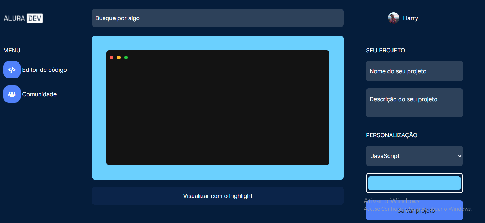

#aluradev
#alurachallengefront2

# ✅ Alura Dev - Editor de código ✅

Alura Dev é um editor de código que te permite compartilhar códigos de forma mais atraente, possibilitando salvar o projeto tanto na aba comunidade como em um arquivo em png, jpeg ou svg.

# ✨ Overview do projeto✨

__O Challenge__ 🚀

Os usuarios serão capazes de:

* Editar o código e setar o highlight
* Salvar o seu projeto na aba comunidades
* Salvar o seu projeto em extensões png, jpeg ou svg
* Verificar seu projeto na aba comunidades
* Projetos permanecerem na aba comunidades.

__Screenshot__ 📱

[Quero Ver!](https://aluradev-five.vercel.app/)

# 🔨 Tech usadas 🔨

* HTML
* CSS
* JavaScript
* Lib highlight
* Hospedagem Vercel

# 👷 Autor 👷

Leandro Jesus Do Nascimento